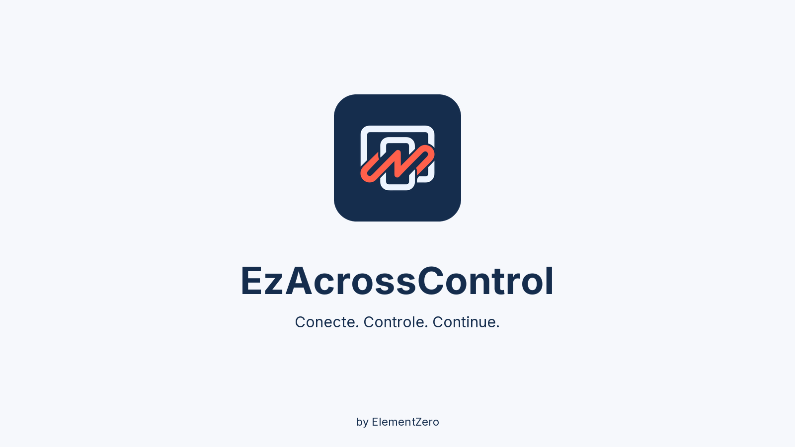
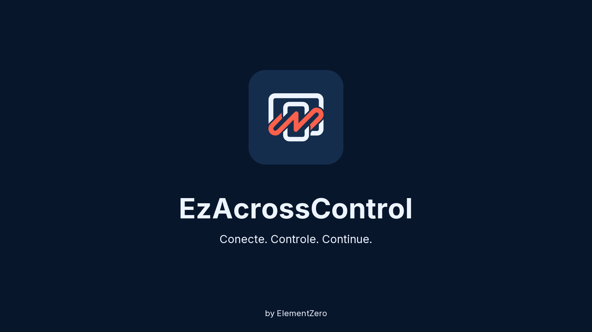

# EzAcrossControl

**Connecter. Contrôler. Continuer.** · by ElementZero

[Toutes les langues et guide technique complet (portugais)](../../README.md)

Contrôlez votre appareil Android avec la souris et le clavier de Windows. Déplacez le pointeur vers le bord choisi de l'écran pour passer d'un appareil à l'autre. Les applications communiquent sur le réseau local, sans compte ni routage par le cloud.

## Télécharger la version Windows 1.1.4 / Android 1.1.5

- [Programme d'installation Windows](https://github.com/eddesignerez/EzAcrossControl/releases/download/v1.1.4/EZAcrossControl-1.1.4-windows-x64-setup.exe)
- [APK Android](https://github.com/eddesignerez/EzAcrossControl/releases/download/v1.1.5/EZAcrossControl-1.1.5-android.apk)
- [ZIP Windows portable](https://github.com/eddesignerez/EzAcrossControl/releases/download/v1.1.4/EZAcrossControl-1.1.4-windows-x64-portable.zip)
- [Versions et contrôles d'intégrité](https://github.com/eddesignerez/EzAcrossControl/releases)

## Configuration requise et première connexion

Il faut Windows 10/11 en 64 bits, Android 7 ou plus récent et les deux appareils sur le même réseau local, même si USB est choisi pour le contrôle natif. Autorisez le débogage USB ou associez le débogage sans fil (Android 11 ou plus récent). Le contrôle natif dépend de la prise en charge UHID par l'appareil.

1. Installez et ouvrez EzAcrossControl sous Windows. L'installation demande les droits d'administrateur pour configurer le serveur local et le pare-feu du réseau privé.
2. Installez l'APK. Sous Android, ouvrez **Mode avancé → Débogage → Ouvrir les paramètres**, activez les options pour les développeurs et le mode de débogage, puis autorisez l'ordinateur.
3. Pour le débogage sans fil, associez l'appareil avec l'ADB inclus en suivant le [guide détaillé](../../README.md#primeiro-uso). L'association et la connexion utilisent des ports différents.
4. Dans l'APK, choisissez **Auto**, **Wi-Fi** ou **USB**. Saisissez l'adresse IP affichée sous Windows et le même port dans les deux applications (par défaut **8765**). Touchez **Connecter**, puis choisissez le bord de l'écran Android sous Windows.

Android suit normalement la langue du système. Modifiez-la dans **Mode avancé → Langue** ; sous Windows, le sélecteur se trouve dans Diagnostics.

## Aperçus et limites

Ce sont des **propositions visuelles statiques, pas des captures de l'application en cours d'exécution**. La typographie et l'harmonisation des couleurs attendent encore une approbation. Les essais sur appareils ont porté uniquement sur HiPadPlus et LAVIE T11 ; les autres modèles doivent être vérifiés. Le programme d'installation Windows ne possède pas de signature Authenticode. Voir le [dépannage et l'architecture](../../README.md#solução-de-problemas) et les [mentions de tiers](../../THIRD-PARTY-NOTICES.md).
